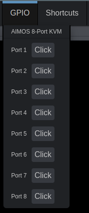
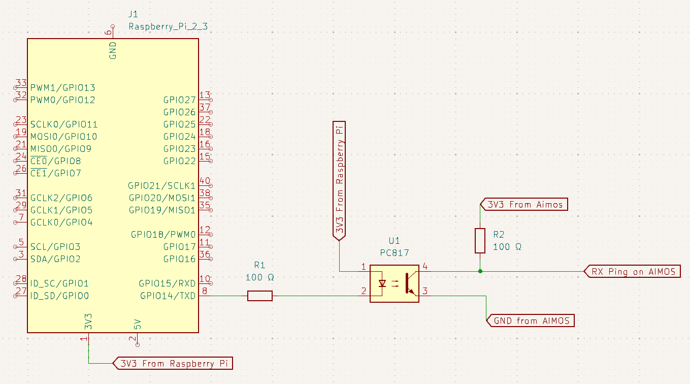
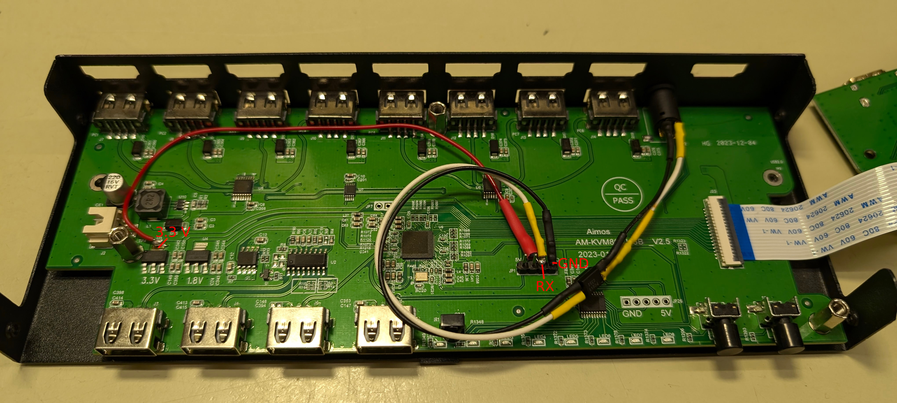
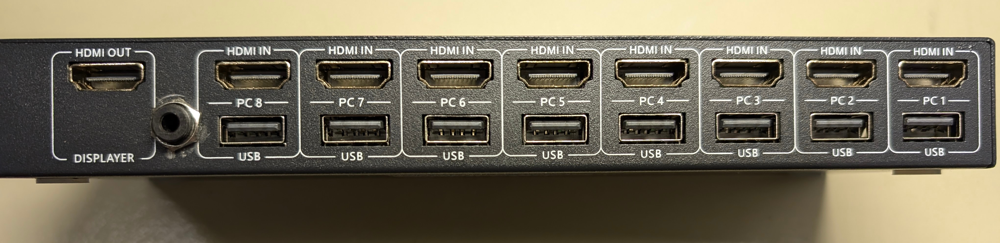

# AIMOS AM-KVM803 UART PiKVM Mod

This mod will allow you to use mass storage (referred to as MSD in PiKVM docs) as well as mouse and keyboard, while still being able to switch to different inputs remotely.



## Installation

### Circuit

You will have to build the following circuit:



Here are some images of the AIMOS for reference:





### PiKVM configuration

1. Open the PiKVM terminal
2. Become `root` user
   ```bash
   su
   ```
3. Make the filesystem writable
   ```bash
   rw
   ```

#### Upload the aimos_select script

4. Open the `/opt/aimos_select` script for editing
   ```bash
   nano /opt/aimos_select
   ```
5. Paste the contents of [src/aimos_select](src/aimos_select)
6. Save and close the file
   ```
   CTRL-S
   CTRL-X
   ```
7. Make the file executable
   ```bash
   chmod +x /opt/aimos_select
   ```

#### Allow the file to be run as root from the web frontend

8. Open the sudoers file for editing
   ```bash
   nano /etc/sudoers.de/custom_commands
   ```
9. Paste the following
   ```
   kvmd ALL=(ALL) NOPASSWD: /opt/aimos_select
   ```
10. Save and close the file
    ```
    CTRL-S
    CTRL-X
    ```

#### Configure the frontend

11. Edit the `/etc/kvmd/override.yaml`
    ```bash
    nano /etc/kvmd/override.yaml
    ```
12. Paste the following
    ```yaml
    kvmd:
      gpio:
        drivers:
          port1:
            type: cmd
            cmd: [/usr/bin/sudo, /opt/aimos_select, 1]
          port2:
            type: cmd
            cmd: [/usr/bin/sudo, /opt/aimos_select, 2]
          port3:
            type: cmd
            cmd: [/usr/bin/sudo, /opt/aimos_select, 3]
          port4:
            type: cmd
            cmd: [/usr/bin/sudo, /opt/aimos_select, 4]
          port5:
            type: cmd
            cmd: [/usr/bin/sudo, /opt/aimos_select, 5]
          port6:
            type: cmd
            cmd: [/usr/bin/sudo, /opt/aimos_select, 6]
          port7:
            type: cmd
            cmd: [/usr/bin/sudo, /opt/aimos_select, 7]
          port8:
            type: cmd
            cmd: [/usr/bin/sudo, /opt/aimos_select, 8]
        scheme:
          port1_button:
            driver: port1
            pin: 0
            mode: output
            switch: false
          port2_button:
            driver: port2
            pin: 0
            mode: output
            switch: false
          port3_button:
            driver: port3
            pin: 0
            mode: output
            switch: false
          port4_button:
            driver: port4
            pin: 0
            mode: output
            switch: false
          port5_button:
            driver: port5
            pin: 0
            mode: output
            switch: false
          port6_button:
            driver: port6
            pin: 0
            mode: output
            switch: false
          port7_button:
            driver: port7
            pin: 0
            mode: output
            switch: false
          port8_button:
            driver: port8
            pin: 0
            mode: output
            switch: false
        view:
          table:
            - ["#AIMOS 8-Port KVM"]
            - []
            - ["#Port 1", port1_button]
            - ["#Port 2", port2_button]
            - ["#Port 3", port3_button]
            - ["#Port 4", port4_button]
            - ["#Port 5", port5_button]
            - ["#Port 6", port6_button]
            - ["#Port 7", port7_button]
            - ["#Port 8", port8_button]
    ```
13. Save and close the file
    ```
    CTRL-S
    CTRL-X
    ```
14. Restart the frontend
    ```bash
    systemctl restart kvmd
    ```

#### Finish up

15. Make the filesystem read-only again
    ```bash
    ro
    ```

## Rationale

In case you are interested why the components are in the circuit and in the arrangement.

- J1: a PC815 optocoupler is used to isolate the two devices electrically
- R1: current limiting resistor for the LED inside of PC817
- R2: pull-up resistor for the RX pin otherwise the Voltage does not rise fast enough for the UART communication to be interpreted
- The optocoupler inverts the signal, thus we invert it again by connecting its LED between 3.3V and TX pin instead of TX and GND

## Limitations / Known Problems

- This mod bypasses the chip that interprets the infrared remote as well as the buttons. Thus the LEDs on the front of the device do not show the changes done via the remote interface. The buttons and infrared remote do still work though.

## Thanks / References

- [PiKVM](https://github.com/pikvm/pikvm) - the project is simply amazing
- [Official Multiport Docs](https://docs.pikvm.org/multiport/#list-of-tested-kvms)
- [4 Port AIMOS mod](https://github.com/pikvm/pikvm/issues/371) - thank you for the inspiration of using an audio cable for the pi - aimos connection and the optocoupler
